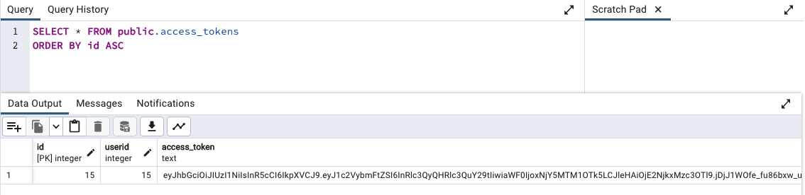

# Database

## init file
location in project:
```
/docker/db/init.sql
```

## Structure
&nbsp;
### `users` table structure
&nbsp;
```
CREATE TABLE IF NOT EXISTS public.users
(
    id integer NOT NULL DEFAULT nextval('users_id_seq'::regclass),
    username character varying(512) COLLATE pg_catalog."default" NOT NULL,
    password character varying(512) COLLATE pg_catalog."default" NOT NULL,
    CONSTRAINT user_pkey PRIMARY KEY (id),
    CONSTRAINT user_username_key UNIQUE (username)
)
```
&nbsp;
####


&nbsp;
####
&nbsp;
### `access_tokens` table structure
&nbsp;
```
CREATE TABLE IF NOT EXISTS public.access_tokens
(
    id integer NOT NULL DEFAULT nextval('access_tokens_id_seq'::regclass),
    userid integer,
    access_token text COLLATE pg_catalog."default" NOT NULL,
    refresh_token text COLLATE pg_catalog."default" NOT NULL,
    CONSTRAINT access_tokens_pkey PRIMARY KEY (id)
)
```
&nbsp;
####


&nbsp;
####
&nbsp;
### `email` table structure
&nbsp;
```
CREATE TABLE IF NOT EXISTS public.emails
(
    id integer NOT NULL DEFAULT nextval('access_tokens_id_seq'::regclass),
    userid integer,
    email character varying(255) COLLATE pg_catalog."default" NOT NULL,
    CONSTRAINT list_of_emails_pkey PRIMARY KEY (id),
    CONSTRAINT list_of_emails_email_key UNIQUE (email)
)
```
&nbsp;
####
