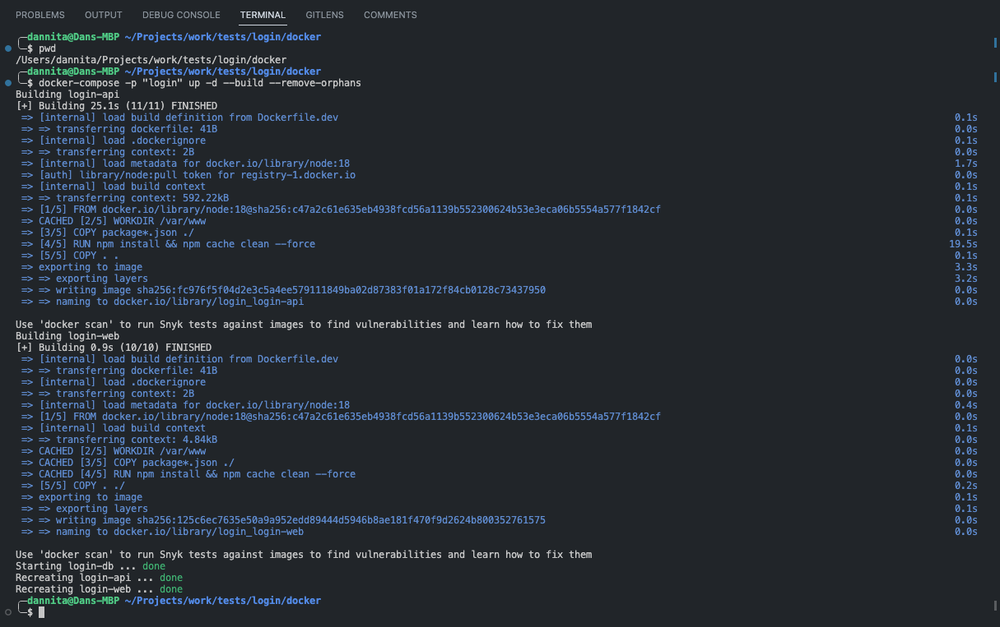
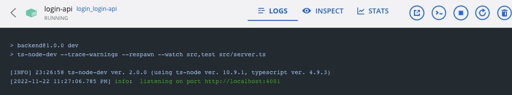
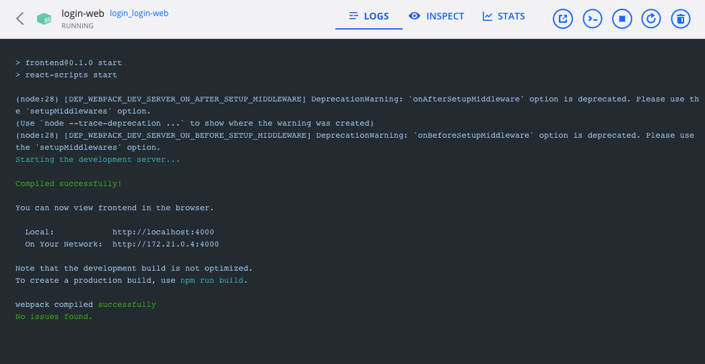
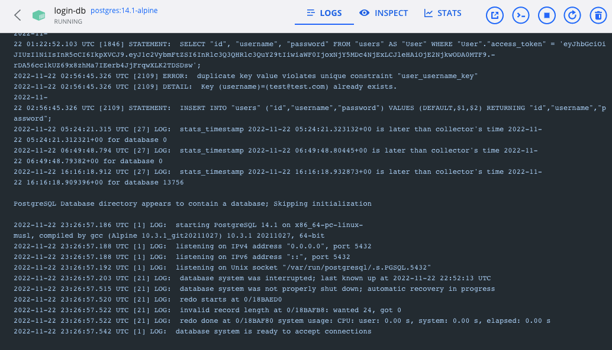
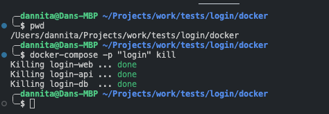
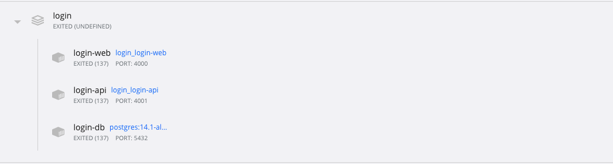

# Installation

## structure
- backend (folder)
- fronend (folder)
- docker (folder)

Go To docker folder and:

start:
```
docker-compose -p "login" up -d --build --remove-orphans
```

stop
```
docker-compose -p "login" kill
```
&nbsp;
####
## images
&nbsp;
####
### docker start cli
&nbsp;
####

&nbsp;
####
### docker start docker desktop
&nbsp;
####

&nbsp;
####
### backend docker start docker desktop
&nbsp;
####

&nbsp;
####
### frontend docker start docker desktop
&nbsp;
####

&nbsp;
####
### posgress server docker start docker desktop
&nbsp;
####

&nbsp;
####
### docker stop cli
&nbsp;
####

&nbsp;
####
### docker stop docker desktop
&nbsp;
####
